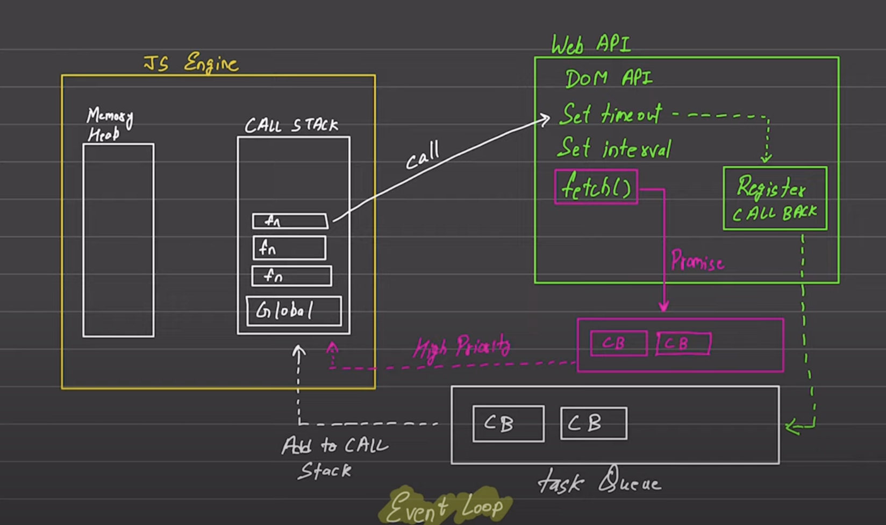

## Javascript is a synchronous single threaded language but for async jobs there is web api call made which then adds the callback function to task queue when required and that task queue adds that callback function back to call stack of JS

